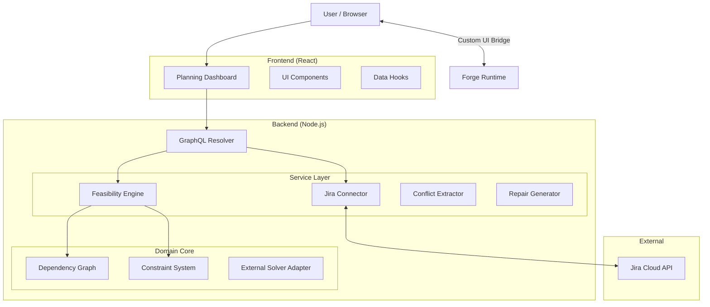

# Jira Planning Mate - Architecture Documentation

**Version:** 1.0.0  
**Last Updated:** January 2026  
**Status:** MVP / Beta

---

## Table of Contents

1. [Executive Summary](#1-executive-summary)
2. [System Overview](#2-system-overview)
3. [System Architecture](#3-system-architecture)
4. [Core Concepts](#4-core-concepts)
5. [Detailed Design](#5-detailed-design)
    *   [5.1 Service Layer](#51-service-layer)
    *   [5.2 Data Flow](#52-data-flow)
    *   [5.3 Algorithms](#53-algorithms)
6. [Data Models](#6-data-models)
7. [Constraint System](#7-constraint-system)
8. [API Reference](#8-api-reference)
9. [Scalability & Performance](#9-scalability--performance)
10. [Security & Permissions](#10-security--permissions)
11. [Development & Operations](#11-development--operations)

---

## 1. Executive Summary

**Jira Planning Mate** is an Atlassian Forge application designed to bring deterministic rigor to Agile PI (Program Increment) Planning. By applying principles from workforce optimization (CuraOps patent), it transforms subjective planning into objective, data-driven feasibility analysis.

Key capabilities include:
*   **Feasibility Certificate**: A binary (Go/No-Go) validation of a plan based on hard constraints.
*   **Conflict Resolution**: Automated identification of minimal conflict sets and generation of repair actions.
*   **Constraint Engine**: A flexible system supporting Capacity, Deadline, Dependency, and Skill-based constraints.

---

## 2. System Overview

The system operates as a **Forge Custom UI** app embedded within Jira Cloud. It leverages the Forge Runtime for backend logic (Node.js) and a React-based frontend for user interaction.

*   **Platform**: Atlassian Forge (FaaS - Function as a Service)
*   **Backend**: Node.js 18+ (Lambda-like environment)
*   **Frontend**: React 18, Webpack bundled, served via Forge Custom UI
*   **Database**: None (Stateless analysis based on live Jira data)

---

## 3. System Architecture

The application follows a **CQRS-inspired** (Command Query Responsibility Segregation) architecture, separating read/analysis operations (Feasibility Engine) from mutation operations (Repair Actions).



---

## 4. Core Concepts

### Feasibility Certificate
A snapshot validation that guarantees a plan is executable under current constraints. A plan is "Feasible" if and only if **zero hard constraint violations** exist.

### Conflict Core
The **Minimal Unsatisfiable Set (MUS)** of issues. Unlike a simple error list, a Conflict Core identifies the smallest subset of issues that create an impossible situation (e.g., "Issue A blocks Issue B, but Issue B must finish before Issue A").

### Repair Actions
Prescriptive changes to resolve conflicts.
*   **Reschedule**: Move to a different iteration.
*   **Reassign**: Move to a different team.
*   **Split**: Break a large issue into smaller children.
*   **Drop**: Remove from the current PI scope.

---

## 5. Detailed Design

### 5.1 Service Layer

| Service | Responsibility | Key Dependencies |
| :--- | :--- | :--- |
| **`jira.ts`** | Abstraction over Jira REST API. Handles fetching issues, sprints, and metadata. | `@forge/api` |
| **`feasibility.ts`** | Orchestrates the planning analysis. Runs the scheduling heuristic. | `dependency.ts`, `constraint.ts` |
| **`conflict-core.ts`** | implementation of the "Conflict Core Extraction" algorithm. | `feasibility.ts` |
| **`repair.ts`** | Generates remediation strategies for identified conflicts. | `conflict-core.ts` |

### 5.2 Data Flow

1.  **Scope Selection**: User provides JQL (e.g., `project = 'PLAN' AND fixVersion = 'PI-24'`).
2.  **Data Ingestion**: `JiraService` fetches all matching issues + linked issues.
3.  **Graph Construction**: `buildDependencyGraph` creates a directed graph of dependencies ($V$ issues, $E$ links).
4.  **Topological Sort**: Determines the mandatory execution order.
5.  **Scheduling Simulation**:
    *   Iterate through sorted issues.
    *   Attempt to assign to the earliest valid Iteration/Team slot.
    *   Check hard constraints (Capacity, Deadlines).
6.  **Violation Collection**: If assignment fails or constraints break, record a `Violation`.
7.  **Result Generation**: Return `FeasibilityResult` with confidence score and violation list.

### 5.3 Algorithms

#### Topological Sort (Kahn's Algorithm)
Used to sequence issues based on blocking dependencies.
*   **Input**: Dependency Graph.
*   **Output**: Linear ordering of issue IDs.
*   **Complexity**: $O(V + E)$.

#### Conflict Extraction (Greedy Hitting Set)
Approximates the minimal set of conflicting issues.
1.  Group violations by constraint type.
2.  Identify issues participating in multiple violations (high "conflict density").
3.  Select issues that cover the maximum number of remaining violations.

---

## 6. Data Models

### Issue Interface (`src/models/types.ts`)
```typescript
interface Issue {
  id: string;
  key: string;
  summary: string;
  estimate?: number;     // Story Points or Hours
  linkedIssues: {
    id: string;
    type: 'blocks' | 'is blocked by';
    inward: boolean;
  }[];
  // ... metadata
}
```

### Feasibility Result
```typescript
interface FeasibilityResult {
  feasible: boolean;
  confidence: number;    // 0.0 to 1.0
  violations: Violation[];
  metadata: {
    totalCapacity: number;
    usedCapacity: number;
  };
}
```

---

## 7. Constraint System

The constraint engine uses a **Strategy Pattern**. New constraints can be added by implementing the `Constraint` interface and registering them in the `ConstraintSystem`.

### Default Constraints

| ID | Type | Category | Description |
| :--- | :--- | :--- | :--- |
| `hard-capacity-001` | **HARD** | CAPACITY | Total estimated work < Team Capacity per iteration. |
| `hard-dependency-001` | **HARD** | DEPENDENCY | No circular dependencies allowed. Predecessors must finish before successors. |
| `hard-deadline-001` | **HARD** | DEADLINE | `DueDate` must be >= Iteration End Date. |
| `soft-skill-001` | *SOFT* | SKILL | Prefer teams with matching Component expertise. |
| `soft-workload-001` | *SOFT* | WORKLOAD | Penalize uneven load distribution across teams. |

---

## 8. API Reference

The backend exposes a GraphQL API via the Forge Resolver.

### `analyzeFeasibility`
*   **Input**: `jql` (string), `iterations` (int), `teams` (string[])
*   **Output**: `FeasibilityResult`
*   **Description**: Runs the full planning simulation.

### `extractConflictCore`
*   **Input**: `jql` (string)
*   **Output**: `ConflictCore[]`
*   **Description**: Identifies why the plan failed.

### `generateRepairActions`
*   **Input**: `conflictId` (string)
*   **Output**: `RepairAction[]`
*   **Description**: Suggests fixes for a specific conflict.

---

## 9. Scalability & Performance

### Computational Complexity
*   **Graph Build**: $O(V + E)$
*   **Scheduling**: $O(V \times I \times T)$ where $I$=Iterations, $T$=Teams.
*   **Constraint Check**: $O(C)$ per assignment attempt.

### Limits
*   **Memory**: Forge functions are limited to ~1GB RAM. Large datasets (>2000 issues) may require batching (future work).
*   **Time**: Execution must complete within Forge timeout (25s).
    *   *Current Mitigation*: The greedy heuristic is fast ($<2s$ for 500 issues).
    *   *Future Mitigation*: Asynchronous job queue for CSP solver integration.

---

## 10. Security & Permissions

*   **Scopes**: The app requests minimum necessary scopes (`read:jira-work`, `read:sprint:jira-software`).
*   **Data Residency**: All data is processed within the customer's Jira instance region (pinned to Forge runtime). No external data egress.
*   **CSP**: Frontend Content Security Policy restricts external scripts/styles (configured in `manifest.yml`).

---

## 11. Development & Operations

### Directory Structure
```
/src
  /services    # Business logic (Pure TypeScript)
  /models      # Interfaces and Types
  /utils       # Shared helpers
  index.ts     # GraphQL Entry Point
/ui            # React Frontend
```

### Build Commands
*   `npm run build`: Compiles Backend (esbuild) and Frontend (Webpack).
*   `npm test`: Runs Jest unit tests.
*   `forge deploy`: Pushes to Atlassian Cloud.
